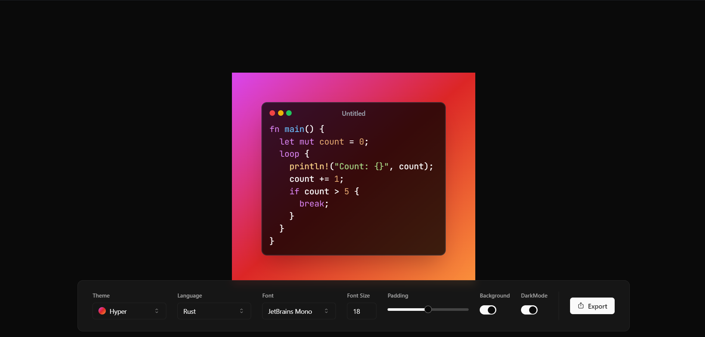

# SyntaxSniper 🚀

Developed a feature-rich code snippet sharing tool, leveraging a modern tech stack and incorporating additional functionalities.

## Features

- **Fully Functional Clone:** Engineered a fully functional using React, Tailwind CSS, Shadcn UI, Zustand, Highlight.js, React Simple Code Editor, HTML to Image, React Hot Toast, Resizable, and Vite technologies. ⚙️

- **Elegant Themes:** Implemented 10+ elegant themes, including both light and dark themes, providing users with a visually appealing and customizable experience. 🌈

- **Font Styles:** Incorporated 12+ font styles, featuring popular and widely recognized font choices to enhance code snippet presentation. 🖋️

- **Language Support:** Ensured broad language support with auto-detection and syntax highlighting, catering to users working with various programming languages. 🚀

- **Export Options:** Enabled multiple export options, allowing users to save code snippets as SVG/PNG, copy to clipboard, and share via generated links. 💾📋🔗

- **Customization Options:** Provided a range of customization options, including font size, padding, background, etc., allowing users to tailor their code snippets to their preferences. 🎨

- **Keyboard Interactions:** Utilized the React Hot Keys Hook for efficient and intuitive keyboard interactions, enhancing user experience. ⌨️

## Project Overview

This project not only demonstrates proficiency in frontend technologies but also showcases creativity and attention to user experience, providing a powerful tool for developers to share and showcase their code snippets seamlessly.

## Tech Stack

- **React:** A declarative, efficient, and flexible JavaScript library for building user interfaces.
- **Tailwind CSS:** A utility-first CSS framework for rapidly building custom user interfaces.
- **Shadcn UI:** [Shadcn UI](https://shadcn-ui.com/) - A design system and components library for React.
- **Zustand:** A small, fast, and scalable state management for React.
- **Highlight.js:** Syntax highlighting library in JavaScript.
- **React Simple Code Editor:** A simple code editor with syntax highlighting.
- **HTML to Image:** Converts HTML/CSS to an image (PNG, SVG).
- **React Hot Toast:** Responsive, stackable, lightweight, customizable toast notifications for React.
- **Resizable:** A resizable component for React.
- **Vite:** A fast build tool that significantly improves the frontend development experience.

## Getting Started

1. Clone the repository.
2. Install dependencies using `npm install`.
3. Run the application with `npm dev`.

## Usage

- Access the code snippet sharing tool in your web browser.
- Create and customize code snippets with various themes and styles.
- Export or share your code snippets seamlessly.

## Contributing

Feel free to contribute to the project by opening issues or submitting pull requests. 🤝

## License

This project is licensed under the [MIT License](LICENSE). 📄
